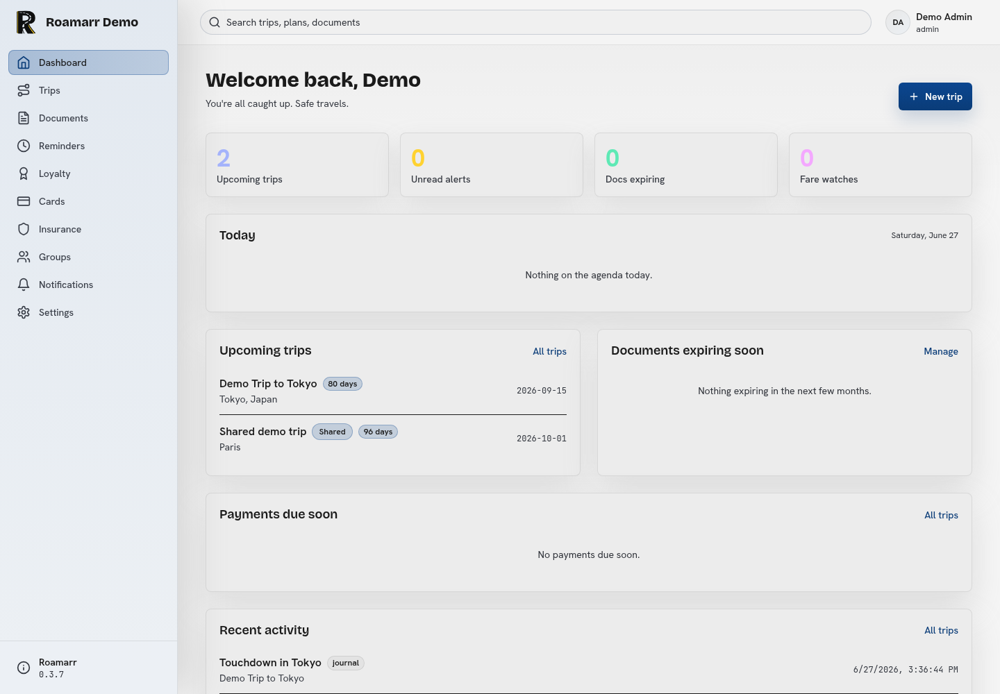
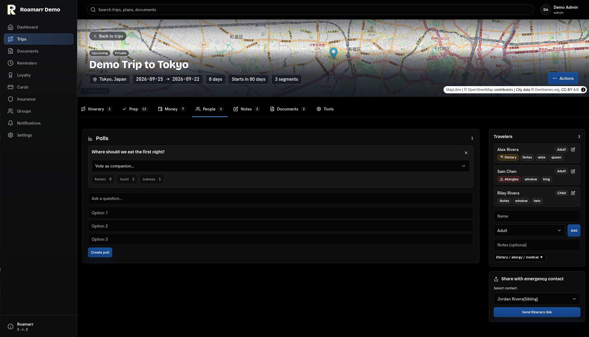
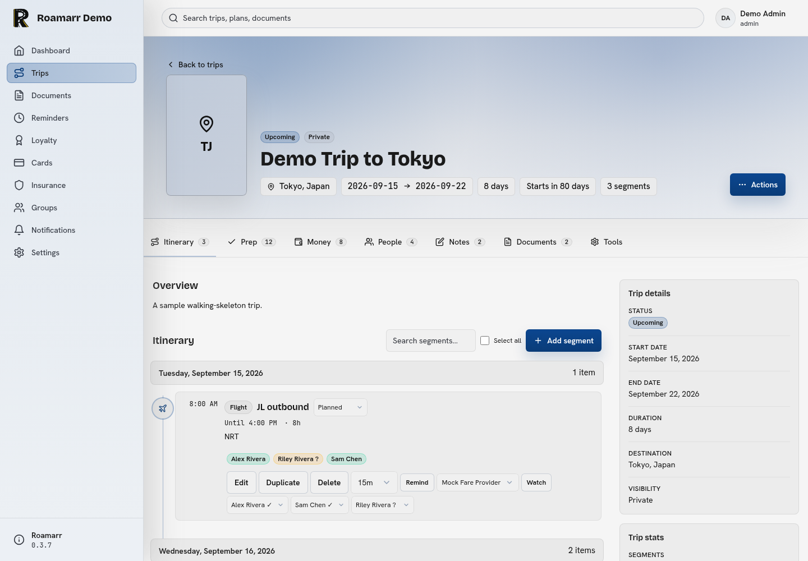
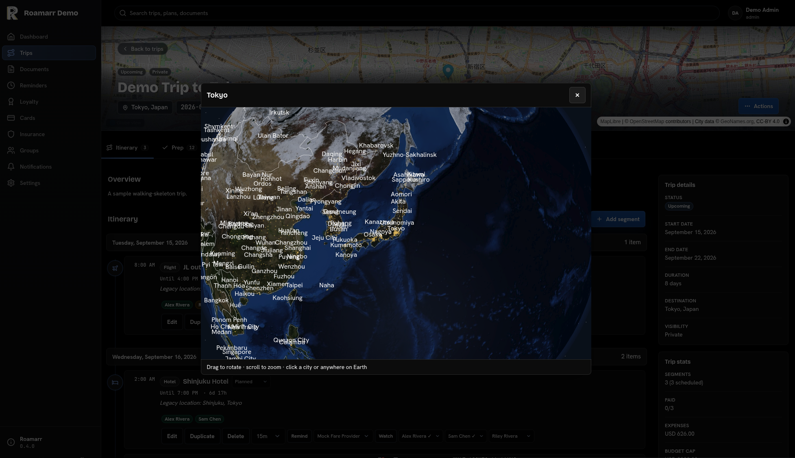
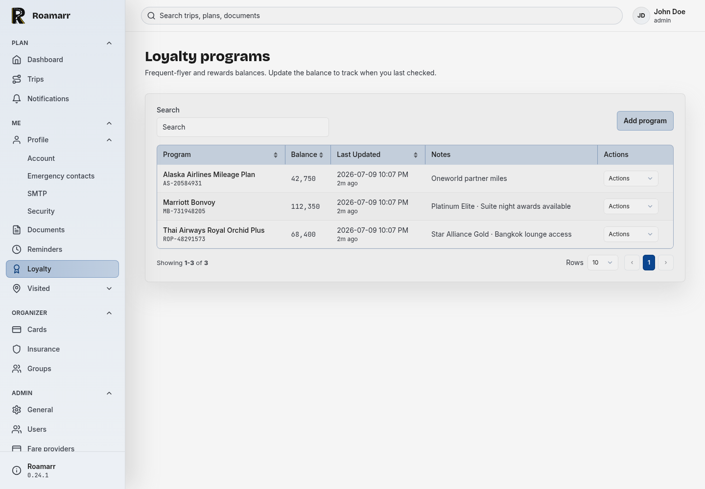
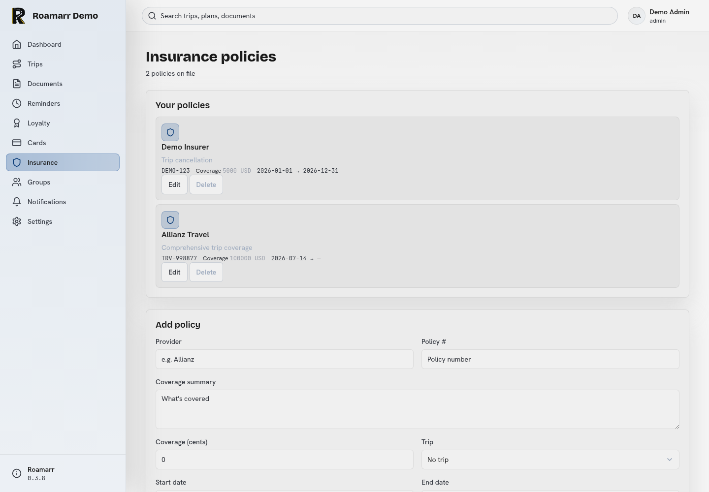

<!-- SPDX-FileCopyrightText: 2026 VisorCraft LLC -->
<!-- SPDX-License-Identifier: GPL-3.0-only -->

<p align="center">
  
</p>

<h1 align="center">Roamarr</h1>

<p align="center">
  <b>A private, self-hosted travel organizer for every moving part of a trip.</b>
  <br />
  Keep flights, stays, documents, companions, reminders, expenses, and sharing in one itinerary hub.
  <br />
  SvelteKit app shell · single-container deploy · encrypted sensitive fields · no hosted travel account required.
</p>

<p align="center">
  <a href="https://github.com/visorcraft/Roamarr/releases/latest"></a>
  <a href="LICENSE"></a>
  
  
  
  
</p>

---

## Screenshots

<table>
  <tr>
    <td width="50%">
      
      <br />
      <sub><b>Dashboard</b> — trips, reminders, documents, and recent activity.</sub>
    </td>
    <td width="50%">
      
      <br />
      <sub><b>Trip people</b> — companions, attendees, and itinerary sharing.</sub>
    </td>
  </tr>
  <tr>
    <td width="50%">
      
      <br />
      <sub><b>Trip itinerary</b> — map hero, timeline cards, tabs, and stats.</sub>
    </td>
    <td width="50%">
      
      <br />
      <sub><b>Trip globe</b> — interactive 3D Earth with cities, borders, and click-to-coordinates.</sub>
    </td>
  </tr>
  <tr>
    <td width="50%">
      
      <br />
      <sub><b>Loyalty programs</b> — memberships, balances, notes, and travel rewards.</sub>
    </td>
    <td width="50%">
      
      <br />
      <sub><b>Insurance policies</b> — coverage details, policy dates, and trip protection.</sub>
    </td>
  </tr>
</table>

---

## What is Roamarr?

Roamarr is a TripIt-style travel organizer you run yourself. It is built as a
single Node.js application with a MongrelDB Kit database, server-rendered SvelteKit
pages, and a practical app shell designed for repeated use rather than a
marketing dashboard.

Roamarr can:

- Track trips, itinerary segments, dates, timezones, booking status, notes,
  tags, favorites, archives, comments, printable itineraries, visited places,
  weather forecasts, and trip-page maps of the next upcoming city.
- Manage flights, hotels, trains, rental cars, rideshares, shuttles, boats,
  food plans, events, parking, directions, points of interest, todos, and free
  form notes.
- Share trips with users, groups, public links, and calendar feeds with
  read/edit/detail controls and token expiry.
- Keep traveler context close to the itinerary: companions, documents, loyalty
  programs, payment cards, insurance policies, entry requirements, medications,
  emergency contacts, important items, and home-preparation tasks.
- Coordinate family and group travel with attendee lists, polls, packing
  templates, kid gear, accessibility notes, dietary details, room preferences,
  and emergency itinerary sharing.
- Track trip expenses with multiple currencies, exchange rates, receipt
  attachments, splits, settlements, budgets, and payment due dates.
- Import and export trip data as JSON or CSV, including dry-run previews before
  importing.
- Send reminders and operational notifications in app, by SMTP, per-user SMTP
  overrides, or through signed webhooks.
- Secure accounts with TOTP authenticator apps, WebAuthn passkeys, backup
  codes, and active session review.
- Connect external clients via OAuth and expose an MCP/AI integration endpoint
  for tool access.
- Run admin workflows for setup, users, registration, audit logs, scheduled
  jobs, backups, restores, demo data, instance stats, health checks, database
  maintenance (integrity check, compaction, flush, and doctor), and map
  configuration (GeoNames city import and raster tile providers).
- Surface license text, runtime credits, package attribution, and app version
  details from the Settings -> About area.

## Your itinerary, under your roof

Travel plans have a strange shape. The critical data is scattered across airline
confirmations, hotel portals, calendar invites, PDF receipts, family texts,
medicine lists, passport dates, and last-minute reminders. Roamarr is meant to
pull that data into one place without handing it to another hosted itinerary
provider.

### One local database

Roamarr stores application data with MongrelDB Kit. By default the database
lives at `./roamarr-db`, and receipt attachments are stored beside it in an
`attachments/` directory. Move the database path, back it up, snapshot it, or
keep it on persistent storage that fits your own setup.

### Private by default

The app requires a `ROAMARR_SECRET` before boot. Sensitive fields such as travel
document numbers, fare-provider API keys, SMTP passwords, TOTP secrets, and
per-user SMTP passwords are encrypted at rest with AES-256-GCM. Passwords use
argon2id, session cookies contain random tokens, and the database stores only
token hashes.

Public share links and calendar feeds use reduced viewer data instead of
dumping every private field attached to a trip. Roamarr is built around the
idea that itinerary sharing should be explicit, scoped, and revocable.

### Built for the actual trip

Roamarr is not just a date list. It tracks the practical, unglamorous work that
happens before and during travel: who is coming, who needs what, what is paid,
what is missing, what expires soon, what needs to be packed, who can see the
itinerary, and what should happen if plans change.

## Setup

### Documentation

Comprehensive user docs live in [`docs/`](./docs/README.md) — covering trips,
sharing, expenses, 2FA, passkeys, weather, per-user SMTP, and MCP/AI
integration.

### Requirements

- Node.js 22.12 or newer.
- npm, using the checked-in `package-lock.json`.
- MongrelDB and MongrelDB Kit npm packages installed by `npm ci`.
- A persistent database path for local app data.
- `ROAMARR_SECRET`, generated with `openssl rand -base64 32`.

If native npm packages need to build on your machine, install your platform's
standard C/C++ build tools before running `npm ci`.

### From source

```bash
git clone https://github.com/visorcraft/Roamarr.git
cd Roamarr

npm ci
cp .env.example .env
openssl rand -base64 32
```

Paste the generated secret into `.env`:

```env
ROAMARR_SECRET=replace-with-output-from-openssl
MONGREL_DATABASE_PATH=./roamarr-db
PORT=3000
ORIGIN=http://localhost:5173
```

> **Important:** `ROAMARR_SECRET` is mandatory. Roamarr uses it to encrypt the Kit
> database and other sensitive fields at rest. If it is not set, the first-boot
> setup page will refuse to create the admin account and will show instructions
> for generating and setting the secret.

Then start the development server:

```bash
npm run dev
```

Open `http://localhost:5173/setup` on first boot.

#### Local dev container

For a containerized dev environment that hot-reloads source edits without an
image rebuild, use `compose.local.yml`:

```bash
export ROAMARR_SECRET="$(openssl rand -base64 32)"
rtk podman compose -f compose.local.yml up -d
```

This bind-mounts the working tree and serves the Vite dev server on
`http://127.0.0.1:3002`. It uses a separate `roamarr-dev-data` volume, so it will
show the first-run setup page until you create the admin account.

### Production build

```bash
npm ci
npm run build
npm start
```

The production server listens on `PORT` or `3000` by default. Set `ORIGIN` to
the public URL when Roamarr is behind a reverse proxy so cookies and redirects
are generated correctly.

Deployment packaging should live outside this source repository. This repository
is focused on building, testing, and running the Roamarr application from
source.

## Configure Roamarr

### Environment

| Variable | Required | Default | Notes |
| -------- | -------- | ------- | ----- |
| `ROAMARR_SECRET` | yes | none | Base64 32-byte key used for encryption. Generate with `openssl rand -base64 32`. The setup page blocks admin creation until this is set. |
| `MONGREL_DATABASE_PATH` | no | `./roamarr-db` | MongrelDB Kit data directory or file path. Takes precedence over `DATABASE_PATH`. |
| `DATABASE_PATH` | no | `./roamarr-db` | Backwards-compatible path. If it looks like a directory (no `.db`/`.sqlite` extension) it is used as the kit data directory. |
| `ATTACHMENTS_PATH` | no | beside database | Directory for receipt attachments. Defaults to an `attachments/` directory next to the resolved database path. |
| `PORT` | no | `3000` | adapter-node listen port. |
| `ORIGIN` | no | none | Public origin for cookies and redirects, especially behind reverse proxies. |

SMTP, webhooks, registration policy, themes, fare providers, backups, and most
admin settings are configured inside the app after setup.

### Runtime data

| Data | Default path |
| ---- | ------------ |
| MongrelDB Kit database | `./roamarr-db` |
| Receipt attachments | `./attachments/` |
| Production build output | `./build/` |
| SvelteKit build cache | `./.svelte-kit/` |

Local `.env` files, databases, logs, build output, dependencies, Playwright
artifacts, and local QA screenshots are ignored by Git. Commit only templates
such as `.env.example`.

## Tweak Roamarr

### Common workflows

```bash
# Start the dev server
npm run dev

# Type-check Svelte and TypeScript
npm run check

# Run the Vitest suite once
npm test

# Run the Playwright end-to-end suite (resets the dev container)
npm run test:e2e

# Install/update Playwright browsers
npm run test:e2e:install

# Build the production app
npm run build

# Run the built app
npm start

# Regenerate bundled license and credits data
npm run credits:generate
```

Migrations are applied automatically during application boot before the
scheduler starts.

### End-to-end tests

Roamarr uses Playwright for browser-level tests that exercise the real UI. The
`test:e2e` script resets the local dev container (`compose.local.yml` on port
3002), creates an admin account, and runs the specs in `tests/e2e/`. Install
Chromium first with `npm run test:e2e:install`, then run the suite with
`npm run test:e2e`.

### Application settings

After the first setup flow, use Settings for:

- Instance name, public registration, and admin controls.
- SMTP delivery, signed webhooks, and per-user notification channels.
- Fare provider accounts and connection tests.
- Backups, restores, scheduled jobs, audit logs, health information, database
  maintenance, and demo data.
- About, project license, third-party package credits, and runtime component
  acknowledgements.

Use Profile for:

- Password changes, email changes, and active session management.
- Security settings: TOTP authenticator setup, backup codes, and WebAuthn
  passkey management.
- Calendar feed token management.
- Per-user theme selection, including High Contrast.
- OAuth client management (for users creating connected clients).

## Architecture

Roamarr is a SvelteKit 2 app using Svelte 5, TypeScript ES modules,
`@sveltejs/adapter-node`, Tailwind CSS v4, MongrelDB Kit, Luxon,
Nodemailer, MapLibre GL JS, and Vitest. Recent additions include WebAuthn
(`@simplewebauthn/*`), TOTP (`otpauth`, `qrcode`), MCP/AI access
(`@modelcontextprotocol/sdk`), 3D globe rendering (`three`), and tar streaming
(`tar-fs`).

Startup imports `src/hooks.server.ts`, requires `ROAMARR_SECRET`, applies
migrations, ensures default settings and benefit templates exist, then starts a
guarded in-process scheduler. The scheduler runs reminders, fare checks,
expired-session cleanup, and run pruning without duplicate starts or
overlapping ticks.

Routes stay thin. Server-side business logic lives under `src/lib/server/`.
Authorization is centralized in sharing and ownership helpers, while public
share and calendar-feed routes expose only a reduced viewer projection.

The main app shell lives in `src/routes/+layout.svelte` and
`src/routes/+layout.server.ts`. Shared components, icons, themes, labels, and
formatting helpers live under `src/lib/`. Database schema and migrations live
under `src/lib/server/db/`. Map rendering uses MapLibre GL JS
with configurable raster tile providers; city data is imported from GeoNames
`cities1000.zip`.

## Contribute

Contributions are welcome through the standard fork-and-pull-request workflow.
Start with [CONTRIBUTING.md](CONTRIBUTING.md), which covers local setup,
coding standards, tests, documentation expectations, dependency policy, and
pull request requirements.

The short version:

```bash
git clone https://github.com/<you>/Roamarr.git
cd Roamarr
git checkout -b fix-or-feature-name

npm ci
npm run check
npm test
npm run build
```

Before opening a pull request, include focused tests for behavior changes,
update relevant docs, and regenerate license data after dependency changes.

## Documentation

- [docs/README.md](docs/README.md) - user documentation index
- [CONTRIBUTING.md](CONTRIBUTING.md) - contribution guidelines
- [docs/SECURITY.md](docs/SECURITY.md) - security policy and disclosure process
- [LICENSE](LICENSE) - GPL-3.0-only license text
- [static/manifest.json](static/manifest.json) - PWA manifest

## License

Roamarr is licensed under GPL-3.0-only. See [LICENSE](LICENSE) for the full
license text, [CONTRIBUTING.md](CONTRIBUTING.md) for contribution guidelines,
and [docs/SECURITY.md](docs/SECURITY.md) for the security disclosure policy.
