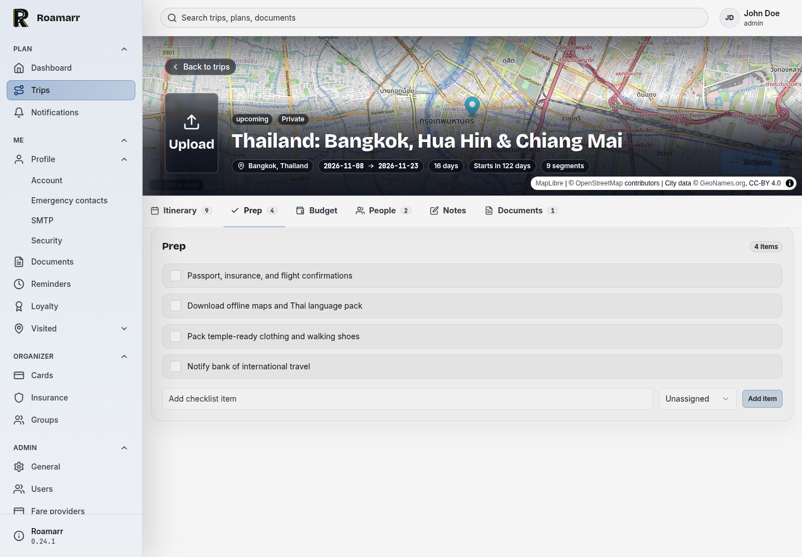
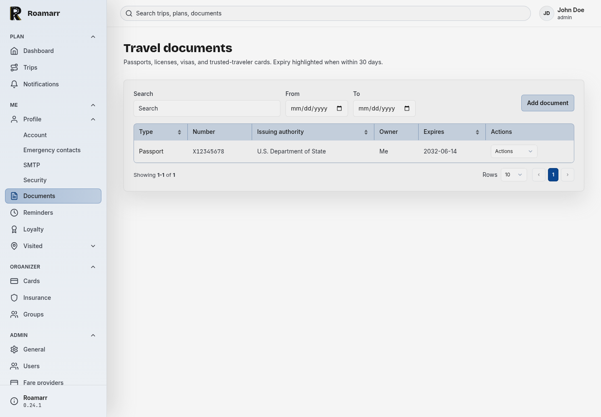
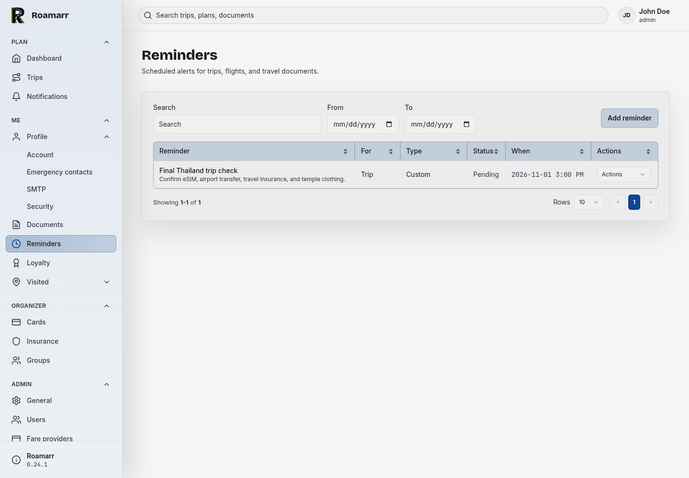
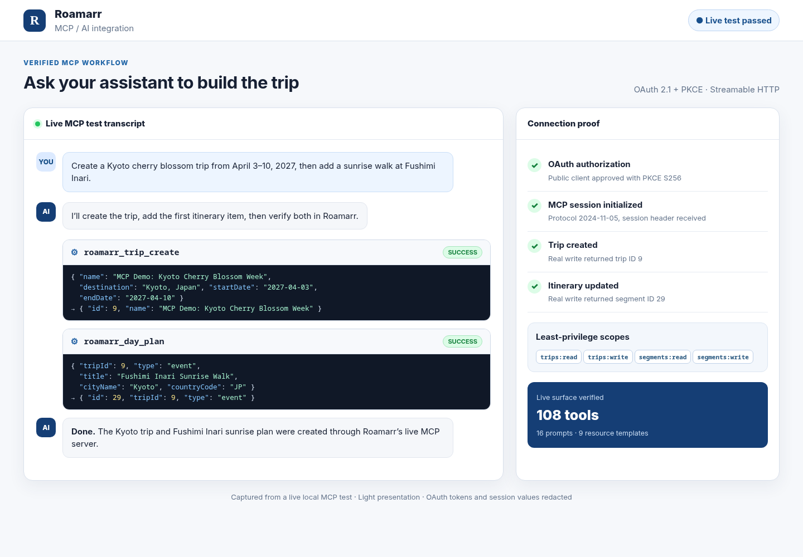

<!-- SPDX-FileCopyrightText: 2026 VisorCraft LLC -->
<!-- SPDX-License-Identifier: GPL-3.0-only -->

<p align="center">
  
</p>

<h1 align="center">Roamarr</h1>

<p align="center">
  <b>A private, self-hosted travel organizer for every moving part of a trip.</b>
  <br />
  Keep flights, stays, documents, companions, reminders, expenses, and sharing in one itinerary hub.
  <br />
  SvelteKit app shell · single-container deploy · encrypted sensitive fields · no hosted travel account required.
</p>

<p align="center">
  <a href="https://github.com/visorcraft/Roamarr/releases/latest"></a>
  <a href="LICENSE"></a>
  
  
  
  
</p>

---

## Screenshots

<table>
  <tr>
    <td width="50%">
      
      <br />
      <sub><b>Dashboard</b> — trips, reminders, documents, and recent activity.</sub>
    </td>
    <td width="50%">
      
      <br />
      <sub><b>Trip people</b> — companions and traveler assignments.</sub>
    </td>
  </tr>
  <tr>
    <td width="50%">
      
      <br />
      <sub><b>Trip itinerary</b> — map hero, timeline cards, tabs, and stats.</sub>
    </td>
    <td width="50%">
      
      <br />
      <sub><b>Trip globe</b> — interactive 3D Earth with cities, borders, and click-to-coordinates.</sub>
    </td>
  </tr>
  <tr>
    <td width="50%">
      
      <br />
      <sub><b>Trip prep</b> — shared checklists for every pre-departure task.</sub>
    </td>
    <td width="50%">
      
      <br />
      <sub><b>Travel documents</b> — passports, visas, licenses, and expiry tracking.</sub>
    </td>
  </tr>
  <tr>
    <td width="50%">
      
      <br />
      <sub><b>Reminders</b> — scheduled trip, flight, and document alerts.</sub>
    </td>
    <td width="50%">
      
      <br />
      <sub><b>Loyalty programs</b> — memberships, balances, notes, and travel rewards.</sub>
    </td>
  </tr>
  <tr>
    <td width="50%">
      
      <br />
      <sub><b>Insurance policies</b> — coverage details, policy dates, and trip protection.</sub>
    </td>
    <td width="50%">
      
      <br />
      <sub><b>MCP / AI workflow</b> — live OAuth connection, trip creation, and itinerary updates.</sub>
    </td>
  </tr>
</table>

---

## What is Roamarr?

Roamarr is a Trip Tracker-style travel organizer you run yourself. It is built as a
single Node.js application with a MongrelDB database, server-rendered SvelteKit
pages, and a practical app shell designed for repeated use rather than a
marketing dashboard.

Roamarr can:

- Track trips, itinerary segments, dates, timezones, booking status, notes,
  tags, favorites, archives, comments, printable itineraries, searchable visited
  country/U.S. state lists, weather forecasts, and trip-page maps of the next
  upcoming city.
- Manage flights, hotels, trains, rental cars, rideshares, shuttles, boats,
  food plans, events, parking, directions, points of interest, todos, and free
  form notes.
- Share trips with users, groups, public links, and calendar feeds with
  read/edit/detail controls and token expiry.
- Keep traveler context close to the itinerary: companions, documents, loyalty
  programs, payment cards, insurance policies, entry requirements, medications,
  emergency contacts, important items, and home-preparation tasks.
- Coordinate family and group travel with attendee lists, polls, packing
  templates, kid gear, accessibility notes, dietary details, room preferences,
  and emergency itinerary sharing.
- Track trip expenses with multiple currencies, exchange rates, receipt
  attachments, splits, settlements, budgets, and payment due dates.
- Import and export trip data as JSON or CSV, including dry-run previews before
  importing.
- Poll a global or per-user IMAP inbox for travel confirmations, parse messages
  with best-effort local rules or an OpenAI-compatible API, and attach imported
  itinerary items to a highly likely trip match or create a new trip.
- Merge an incorrect donor trip into a recipient while retaining itinerary,
  documents, expenses, companions, and other trip data.
- Send reminders and operational notifications in app, by SMTP, per-user SMTP
  overrides, or through signed webhooks.
- Secure accounts with TOTP authenticator apps, WebAuthn passkeys, backup
  codes, and active session review.
- Connect external clients via OAuth (59 scopes, PKCE, refresh-token
  rotation, and Dynamic Client Registration) and expose an MCP integration endpoint with 108 tools, 16
  prompts, and 9 resource templates — covering trips, segments, expenses, polls,
  companions, wallet (cards/loyalty/insurance/documents), sharing, reminders,
  templates, and profile preferences. Destructive operations require an explicit
  `confirm: true`. Payment-card, policy, membership, and travel-document numbers
  stay redacted. Administrators can optionally let users approve private trip
  notes, confirmation numbers, and itinerary details per MCP client.
- Run admin workflows for setup, users, registration, audit logs, scheduled
  jobs, backups, restores, demo data, instance stats, health checks, database
  maintenance (integrity check, compaction, flush, and doctor), and map
  configuration (GeoNames city import and raster tile providers).
- Surface license text, runtime credits, package attribution, and app version
  details from the About page.

## Your itinerary, under your roof

Travel plans have a strange shape. The critical data is scattered across airline
confirmations, hotel portals, calendar invites, PDF receipts, family texts,
medicine lists, passport dates, and last-minute reminders. Roamarr is meant to
pull that data into one place without handing it to another hosted itinerary
provider.

### One local database

Roamarr stores application data with MongrelDB. By default the database
lives at `./roamarr-db`, and receipt attachments are stored beside it in an
`attachments/` directory. Move the database path, back it up, snapshot it, or
keep it on persistent storage that fits your own setup.

### Private by default

The app requires a `ROAMARR_SECRET` before boot. Sensitive fields such as travel
document numbers, fare-provider API keys, SMTP passwords, TOTP secrets, and
per-user SMTP passwords are encrypted at rest with AES-256-GCM. Passwords use
argon2id, session cookies contain random tokens, and the database stores only
token hashes.

Public share links and calendar feeds use reduced viewer data instead of
dumping every private field attached to a trip. Roamarr is built around the
idea that itinerary sharing should be explicit, scoped, and revocable.

### Built for the actual trip

Roamarr is not just a date list. It tracks the practical, unglamorous work that
happens before and during travel: who is coming, who needs what, what is paid,
what is missing, what expires soon, what needs to be packed, who can see the
itinerary, and what should happen if plans change.

## Setup

### Documentation

Comprehensive user docs live in [`docs/`](./docs/README.md) — covering trips,
sharing, expenses, 2FA, passkeys, weather, per-user SMTP, and MCP/AI
integration.

### Requirements

- Node.js 22.12 or newer.
- npm, using the checked-in `package-lock.json`.
- MongrelDB (with the MongrelDB Kit toolkit) installed by `npm ci`.
- A persistent database path for local app data.
- `ROAMARR_SECRET`, generated with `openssl rand -base64 32`.

If native npm packages need to build on your machine, install your platform's
standard C/C++ build tools before running `npm ci`.

### From source

```bash
git clone https://github.com/visorcraft/Roamarr.git
cd Roamarr

npm ci
cp .env.example .env
openssl rand -base64 32
```

Paste the generated secret into `.env`:

```env
ROAMARR_SECRET=replace-with-output-from-openssl
DATABASE_PATH=./roamarr-db
# Optional. Set both to require MongrelDB credential authentication.
DATABASE_USER=roamarr
DATABASE_PASS=replace-with-a-strong-password
PORT=3000
ORIGIN=http://localhost:5173
```

> **Important:** `ROAMARR_SECRET` is mandatory. It must be a base64-encoded
> 32-byte value (generate with `openssl rand -base64 32`); other lengths are
> rejected at boot. Roamarr uses it as the AES-256 key for sensitive fields at
> rest and to unlock the encrypted Kit database. If it is missing or invalid, the
> first-boot setup page will refuse to create the admin account and will show
> instructions for generating and setting the secret.
>
> `DATABASE_USER` and `DATABASE_PASS` are optional, but must be set together
> before the database is first created. They create the MongrelDB administrator
> and require credential authentication in addition to encryption. Keep them
> stable; changing or omitting them prevents the authenticated database opening.

Then start the development server:

```bash
npm run dev
```

Open `http://localhost:5173/setup` on first boot.

#### Local dev container

For a containerized dev environment that hot-reloads source edits without an
image rebuild, use `compose.local.yml`:

```bash
export ROAMARR_SECRET="$(openssl rand -base64 32)"
podman compose -f compose.local.yml up -d
```

This bind-mounts the working tree and serves the Vite dev server on
`http://127.0.0.1:3002`. It uses a separate `roamarr-dev-data` volume, so it will
show the first-run setup page until you create the admin account.

### Production build

```bash
npm ci
npm run build
npm start
```

The production server listens on `PORT` or `3000` by default. Set `ORIGIN` to
the public URL when Roamarr is behind a reverse proxy so cookies and redirects
are generated correctly.

Deployment packaging should live outside this source repository. This repository
is focused on building, testing, and running the Roamarr application from
source.

## Configure Roamarr

### Environment

| Variable | Required | Default | Notes |
| -------- | -------- | ------- | ----- |
| `ROAMARR_SECRET` | yes | none | Base64-encoded 32-byte AES key. Generate with `openssl rand -base64 32`; other lengths are rejected at boot. The setup page blocks admin creation until a valid secret is set. |
| `DATABASE_PATH` | no | `./roamarr-db` | MongrelDB data directory or file path. |
| `DATABASE_USER` | no | none | MongrelDB administrator username. Must be set with `DATABASE_PASS` before first creation. |
| `DATABASE_PASS` | no | none | MongrelDB administrator password. Must be set with `DATABASE_USER` before first creation. |
| `ATTACHMENTS_PATH` | no | beside database | Directory for receipt attachments. Defaults to an `attachments/` directory next to the resolved database path. |
| `PORT` | no | `3000` | adapter-node listen port. |
| `ORIGIN` | no | none | Public origin for cookies and redirects, especially behind reverse proxies. |

SMTP, IMAP, email parsing, webhooks, registration policy, themes, fare
providers, backups, and most admin settings are configured inside the app after
setup.

### Runtime data

| Data | Default path |
| ---- | ------------ |
| MongrelDB database | `./roamarr-db` |
| Receipt attachments | `./attachments/` |
| Production build output | `./build/` |
| SvelteKit build cache | `./.svelte-kit/` |

Local `.env` files, databases, logs, build output, dependencies, Playwright
artifacts, and local QA screenshots are ignored by Git. Commit only templates
such as `.env.example`.

## Tweak Roamarr

### Common workflows

```bash
# Start the dev server
npm run dev

# Type-check Svelte and TypeScript
npm run check

# Run the Vitest suite once
npm test

# Run the Playwright end-to-end suite (resets the dev container)
npm run test:e2e

# Install/update Playwright browsers
npm run test:e2e:install

# Build the production app
npm run build

# Run the built app
npm start

# Regenerate bundled license and credits data
npm run credits:generate

# Bump the version (patch | minor | major | x.y.z). Updates package.json,
# package-lock.json root version, and regenerates the license/credits data
# so the About page stays in sync.
npm run version:bump -- patch
```

Migrations are applied automatically during application boot before the
scheduler starts.

### End-to-end tests

Roamarr uses Playwright for browser-level tests that exercise the real UI. The
`test:e2e` script resets the local dev container (`compose.local.yml` on port
3002), creates an admin account, and runs the specs in `tests/e2e/`. Install
Chromium first with `npm run test:e2e:install`, then run the suite with
`npm run test:e2e`.

### Application settings

After the first setup flow, use the admin pages for:

- Instance name, public registration, and admin controls.
- Global and per-user SMTP/IMAP policy, email parsing providers, polling
  interval, and signed webhooks.
- Fare provider accounts and connection tests.
- Backups, restores, scheduled jobs, audit logs, health information, database
  maintenance, and demo data.
- Project license, third-party package credits, runtime component
  acknowledgements, and app details on the About page.

Use Profile for:

- Password changes, email changes, and active session management.
- Visited Countries and U.S. States, with visit-date editing and quick
  country/state list toggles.
- Security settings: TOTP authenticator setup, backup codes, and WebAuthn
  passkey management.
- Per-user theme selection, including High Contrast.
- MCP client management and OAuth credentials for manually registered clients.

Use each trip's Share page for user/group access, public links, and calendar
feed URL management.

### Email processing

Roamarr can monitor one global inbox, individual user inboxes, or both. Inbox
processing runs through the guarded scheduler; it does not require an inbound
webhook.

Administrators configure instance-wide behavior under **Configuration →
Email**:

- **User Access** controls whether users may configure personal IMAP, personal
  SMTP, and personal AI parsing providers. Per-user IMAP is allowed by default;
  per-user SMTP and parsing providers are denied by default.
- **Inbound Emails** configures the optional global IMAP inbox. Global inbox
  processing is enabled by default on a new installation, but does nothing
  until valid connection details are saved. For every new message, Roamarr
  matches the sender address to an enabled user. Mail from an unknown sender is
  ignored and will not be retried.
- **AI Parsing** configures a global OpenAI-compatible parsing provider. Supply
  the provider base URL, exact model ID, and either an API/subscription key or
  OAuth client credentials.
- **Outbound Emails** configures global SMTP for system notifications. This
  connection is not used to ingest incoming travel mail.

Set the scheduler interval under **Configuration → General → Email polling
interval**. Each user can then open **Profile → Email Settings**:

- **Inbound Emails** enables and configures that user's IMAP mailbox.
- **AI Parsing** optionally overrides the global parser when per-user providers
  are allowed. A valid enabled user provider wins. Otherwise Roamarr falls back
  to the global provider, then to built-in no-AI parsing. Without AI, parsing
  matches are best effort and may fall short on accuracy.
- **Outbound Emails** selects personal SMTP when allowed, or reuses the inbound
  server credentials. Otherwise notifications use global SMTP.

Parsed confirmations are matched against trip dates, confirmation codes,
travel terms, destinations, and overlap. A highly likely match adds itinerary
items to the existing trip. Otherwise Roamarr creates a new trip. If a message
lands on the wrong trip, use **Trips → Merge** to move itinerary items,
documents, and related trip data from the donor trip into the recipient.

IMAP passwords, SMTP passwords, API/subscription keys, and OAuth client secrets
are encrypted before storage. Disabling an inbox hides its connection fields
without deleting the saved credentials.

### MCP clients and OAuth

Roamarr exposes its Streamable HTTP MCP server at:

```text
https://your-roamarr.example/mcp
```

OAuth discovery is available at:

```text
https://your-roamarr.example/.well-known/oauth-authorization-server
```

The OAuth server supports authorization code flow, mandatory S256 PKCE,
refresh-token rotation, public clients, confidential clients using
`client_secret_post`, token revocation, and RFC 7591 Dynamic Client
Registration at `/oauth/register`.

#### Automatic registration

Clients such as Open WebUI can register automatically:

1. In Open WebUI, open **Admin Settings → External Tools** and add a server.
2. Select **MCP (Streamable HTTP)**.
3. Enter the Roamarr `/mcp` URL.
4. Select **OAuth 2.1**, register the client, and save it.
5. Enable the tool from a chat and approve Roamarr's consent screen.

Dynamic clients are public PKCE clients unless they explicitly request
`client_secret_post`. Roamarr validates callback URLs, allowing HTTPS URLs and
HTTP only for loopback hosts. The first user who approves a dynamically
registered client can manage it under **Profile → MCP Clients**.

Administrators can hide and block this page, manual registration, and Dynamic
Client Registration by disabling **Configuration → MCP Clients → Allow users to
set up MCP Clients**. This policy is disabled by default on new installations.
Existing issued tokens remain independently revocable.

Private trip details are also disabled by default. An administrator must enable
**Configuration → MCP Clients → Allow private travel details through MCP**, and
each user must separately approve the optional `private-details:read` permission
for that client. Payment-card, policy, membership, and travel-document numbers
remain redacted.

If the administrator configures **Configuration → MCP Clients → Allowed client
IDs**, open Dynamic Client Registration is disabled. Use manual registration
instead. If needed, temporarily clear the allow-list, create the manual client,
then add its generated client ID before restoring the restriction.

#### Manual registration

Use **Profile → MCP Clients** when a client supplies fixed callback
URLs or does not support Dynamic Client Registration:

1. Enter a recognizable client name.
2. Copy the client's exact Redirect URI. This is not the Roamarr URL. Scheme,
   host, port, path, and trailing slash must match exactly.
3. Select only the scopes the client needs.
4. Choose a public client for desktop or local applications that cannot safely
   store a secret. Public clients authenticate with PKCE.
5. Create the client, then immediately copy its client ID and, for a
   confidential client, its one-time client secret.

Common callback examples include:

- Local application: `http://localhost:3000/callback`
- Hosted application: `https://app.example.com/oauth/callback`
- LM Studio: `http://127.0.0.1:33389/mcp-oauth-callback`

LM Studio can connect by adding the Roamarr `/mcp` URL to its MCP configuration
and supplying the manually created client ID and secret when static credentials
are required. Ollama itself is a model server, not an OAuth MCP client; when an
application uses Ollama as its model backend, register the surrounding MCP host
application and use that application's callback URL.

Every client is limited to its registered scopes and the scopes approved on the
consent screen. MCP reads use privacy-safe projections. Sensitive document,
membership, policy, and payment-card numbers remain stripped from AI-facing
responses. Private trip notes, confirmation numbers, and itinerary details need
both the administrator gate and per-client user consent. Destructive MCP tools
also require `confirm: true`.

## Architecture

Roamarr is a SvelteKit 2 app using Svelte 5, TypeScript ES modules,
`@sveltejs/adapter-node`, Tailwind CSS v4, MongrelDB (via MongrelDB Kit), Luxon,
Nodemailer, MapLibre GL JS, and Vitest. Recent additions include WebAuthn
(`@simplewebauthn/*`), TOTP (`otpauth`, `qrcode`), MCP/AI access
(`@modelcontextprotocol/sdk`), 3D globe rendering (`three`), and tar streaming
(`tar-fs`).

Startup imports `src/hooks.server.ts`, requires `ROAMARR_SECRET`, applies any
pending restore, runs migrations, ensures default settings and benefit templates
exist, then starts a guarded in-process scheduler. The scheduler tick runs
reminders, fare checks, weather-cache refresh, per-user IMAP ingestion, expiry
purges (sessions, passkey challenges, OAuth tokens, rate-limit buckets, share
windows), memtable flush, hourly compaction, and run pruning — without duplicate
starts or overlapping ticks.

Routes stay thin. Server-side business logic lives under `src/lib/server/`.
Trip access is centralized in three ownership helpers — `requireOwnedTrip`
(owner only), `requireEditableTrip` (owner + edit-share), and
`requireViewableTrip` (owner + any share) — so MCP tools, route actions, and
resource reads all share one consistent authorization layer. Public share and
calendar-feed routes expose only a reduced `viewerProjection`.

The main app shell lives in `src/routes/+layout.svelte` and
`src/routes/+layout.server.ts`. Shared components, icons, themes, labels, and
formatting helpers live under `src/lib/`. Database schema and migrations live
under `src/lib/server/db/`. Map rendering uses MapLibre GL JS
with configurable raster tile providers; city data is imported from GeoNames
`cities1000.zip`.

### Map and globe attribution

Roamarr bundles and renders data from third-party sources:

- Country borders in the 3D globe (`static/maps/countries.geojson`) are from
  [Natural Earth](https://www.naturalearthdata.com/) (public domain).
- The optional Earth texture is NASA's
  [Blue Marble](https://visibleearth.nasa.gov/collection/1484/blue-marble)
  imagery (public domain).
- City points and labels come from
  [GeoNames](https://www.geonames.org/) under
  [CC BY 4.0](https://creativecommons.org/licenses/by/4.0/).
- Default raster tiles come from
  [OpenStreetMap](https://www.openstreetmap.org/copyright) contributors, with
  attribution passed through from the configured tile provider.

## Contribute

Contributions are welcome through the standard fork-and-pull-request workflow.
Start with [CONTRIBUTING.md](CONTRIBUTING.md), which covers local setup,
coding standards, tests, documentation expectations, dependency policy, and
pull request requirements.

The short version:

```bash
git clone https://github.com/<you>/Roamarr.git
cd Roamarr
git checkout -b fix-or-feature-name

npm ci
npm run check
npm test
npm run build
```

Before opening a pull request, include focused tests for behavior changes,
update relevant docs, and run `npm run credits:generate` after dependency
changes so Credits/Acknowledgements and Third-party Licenses match
`package-lock.json`.

## Documentation

- [docs/README.md](docs/README.md) - user documentation index
- [CONTRIBUTING.md](CONTRIBUTING.md) - contribution guidelines
- [docs/SECURITY.md](docs/SECURITY.md) - security policy and disclosure process
- [LICENSE](LICENSE) - GPL-3.0-only license text
- [static/manifest.json](static/manifest.json) - PWA manifest

## License

Roamarr is licensed under GPL-3.0-only. See [LICENSE](LICENSE) for the full
license text, [CONTRIBUTING.md](CONTRIBUTING.md) for contribution guidelines,
and [docs/SECURITY.md](docs/SECURITY.md) for the security disclosure policy.
